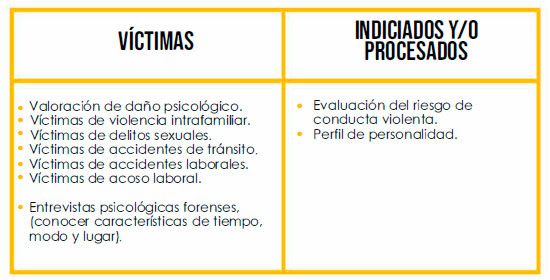

## Peritajes Psicológicos Forenses

Artículo 226 Código General del Proceso. La prueba pericial es procedente para verificar hechos que interesen al proceso y requieran especiales conocimientos científicos, técnicos o artísticos.

Es importante resaltar que el Instituto Nacional de Medicina Legal y Ciencias Forenses, generó la «guía para la realización de pericias psiquiátricas o Psicológicas forenses, sobre daño psíquico, con fines de in­demnización, conciliación o reparación», dirigida a todos los psiquiatras y psicólogos que realizan pericias forenses, definiendo el DAÑO PSÍQUICO.

En el ámbito del Derecho, el papel del psicólogo resulta sumamente importante a la hora de determinar el comportamiento de determinadas personas de acuerdo a la ley y el Derecho. Es lo que se conoce como peritaje psicológico y cada vez es más demandado por los abogados y juristas a la hora de desarrollar juicios en este ámbito de actuación.

## ¿Qué es un peritaje psicológico?
El perito psicológico se encarga del asesoramiento peritaje en distintos constructos jurídicos atendiendo a la capacidad de las personas en la toma de determinadas decisiones. De este modo, la labor del perito psicológico es crucial en la valoración de los hechos judiciales, entre ellos los civiles.

Integrado completamente en el panorama judicial, la figura del psicólogo es fundamental, ya que la prueba pericial y las pruevas psicológicas que emite tiene la consideración de prueba científica. El perito psicólogico o los denomiados como psicólogos forenses actúan de manera independiente, sin interés ni razón que motive su dictamen, a menudo sin conocimientos previos del tema, por lo que su trabajo, absolutamente imparcial, es una razón de peso en el entorno jurídico civil.

## ¿Cómo se realiza el pertije psicológico?
El peritaje psicológico o una pericia psicológica puede llevarse a cabo previa petición de una de las partes que trabajan en un determinado proceso judicial o del tribunal que dirige la vista. Una vez designado al profesional que realizará un informe pericial psicológico, este profesional contará con cinco días para decidir si acepta o no la solicitud. La aceptación obligará al perito psicólogo a jurar dicho nombramiento.

Según lo haya contratado el cliente o lo haya designado el juez, el perito deberá realizar su evaluación y elaborar su dictamen, que entregará en el plazo convenido a las partes solicitantes (fiscalía, tribunal parte contraria) o al juzgado, en el supuesto de que lo solicitase este organismo judicial.

Las pruebas psicológicas en las que este experto basa su informe o peritje psicológico son varias:

- El análisis de la documentación aportada por las partes o por el tribunal
- La interacción con los sujetos implicados en el caso
- El desarrollo de pruebas psicológicas
- La consulta de otras pruebas, como pueden ser las neurológicas
- Entrevistas con el resto de profesionales que trabajan en el caso
Asimismo, deberá asistir a la vista ya que su presencia posibilitará aclarar cualquier aspecto poco claro, así como ratificar lo argumentado en el dictamen por él presentado.

## ¿Cuándo es necesario realizar un peritaje psicológico civil?
La pericia psicológica en requerida en muchos campos del Derecho. De este modo, un perito psicológico está presente en cuestiones relacionados con:

1. Competencias parentales
Cuando un niño está en una situación de riesgo, requiere de una pericia psicológica para determinar si los padres son capaces de tutelar al menor. En algunos casos estos psicólogos forenses se encargarán de establecer las condiciones para que el niño/a tenga un tutor legal que se adhiera a sus necesidades. 

2. Situaciones de incapacidad
En aquellos casos en los que una persona ha sufrido un accidente y requiere avalar su situación de incapacidad ya sea para obtener una indemnización como por otras razones, el perito psicológico es el encargado de realizar las pruebas y de determinarlo. 

3. Valoración de daños y secuelas psicopatológicas
El peritaje psicológico también es demandado en aquellas situaciones en las que existen ciertos daños en una persona que exigen de justicia. Por lo tanto, el perito psicológico evaluará las secuelas de la víctima. 

Asimismo, el labor de un perito psicológico es importante en el desarrollo de procesos civiles junto al trabajo del abogado, ya que se encarga de realizar evaluaciones, como las concernientes a situaciones de riesgo en menores, así como informes, tales como los de idoneidad en procesos de acogida, de reasignación de sexo, sobre capacitaciones civiles (permiso de armas, conducción de vehículos, ensayos clínicos, etc.). A todo lo anterior debemos sumar su labor como mediador en asuntos civiles, que está fuera de toda duda.