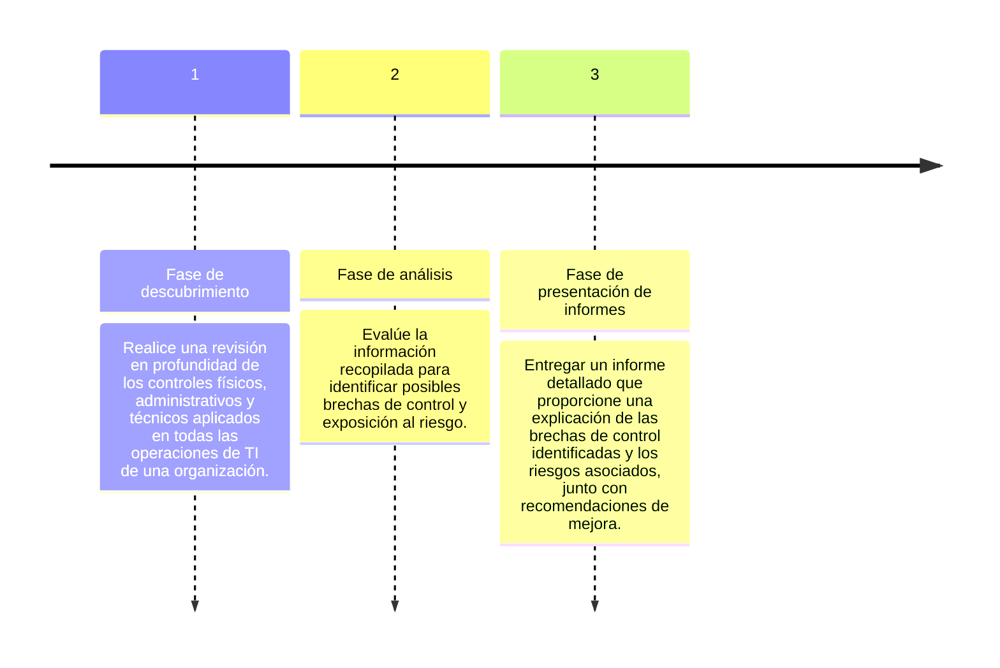

---

title: Auditoría de controles generales de TI
description: Identificando las vulnerabilidades de su sistema y el nivel de riesgo de su empresa puede reforzar estratégicamente la seguridad
date: 2024-03-09T20:24:49.742Z
preview: ../../assets/svg/undraw/undraw_confirmation_re_b6q5.svg
draft: false
tags:
  - auditoria
  - penal
  - empresas
categories:
  - derecho-penal
  - tecnologia
author: juan-oliver
publishDate: 2024-03-09T20:24:49.742Z
coverSVG: ../../assets/svg/undraw/undraw_confirmation_re_b6q5.svg
socialImage: ../../assets/svg/undraw/undraw_confirmation_re_b6q5.svg
socialImageAlt: "Persona mirando un checklist"
type: default
---

Nuestros servicios de auditoría de TI proporcionan una revisión independiente y objetiva de la infraestructura de TI de una organización, la configuración de los controles y el cumplimiento de la normativa mediante pruebas exhaustivas y análisis de expertos. Como parte de nuestros servicios de auditoría de TI, nuestro equipo recopila y evalúa pruebas de los controles técnicos, políticas y procedimientos de su organización, así como otra documentación relacionada para garantizar la disponibilidad, confidencialidad e integridad de los sistemas y datos de misión crítica. Nuestro equipo trabaja directamente con el suyo para garantizar la eficacia durante todo el proceso de auditoría.

Los auditores de RMF cuentan con años de experiencia tanto en el sector real como en el financiero.

## Beneficios de la auditoría de TI

- Identifique y corrija las brechas de TI
- Evalúe y mejore los controles de seguridad para proteger adecuadamente los activos confidenciales de TI y de información
- Garantizar el cumplimiento de las normativas de seguridad de datos, privacidad y ciberseguridad
- Mejore la postura de seguridad general de su organización

## Nuestro proceso de auditoría

